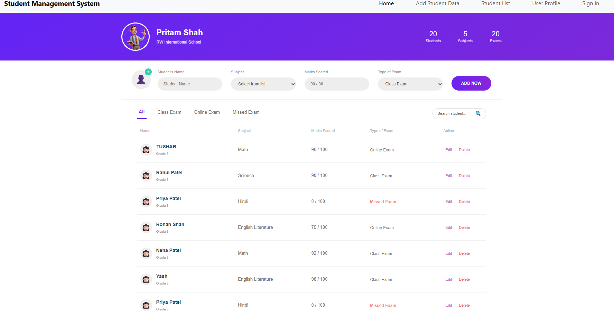
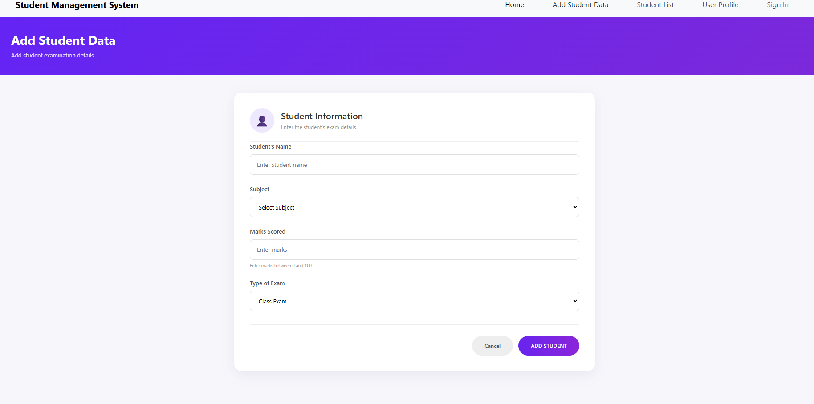
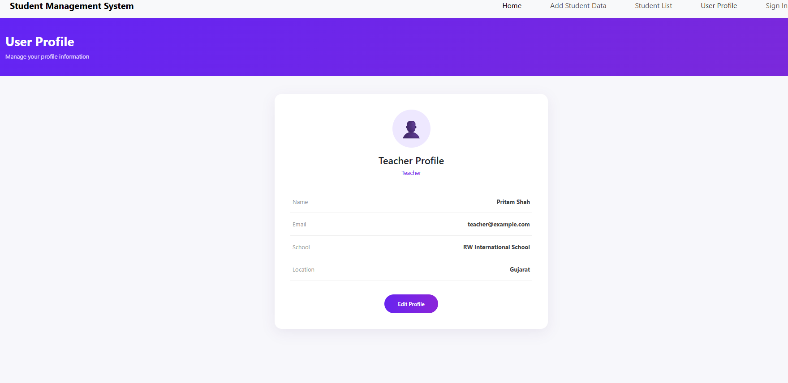
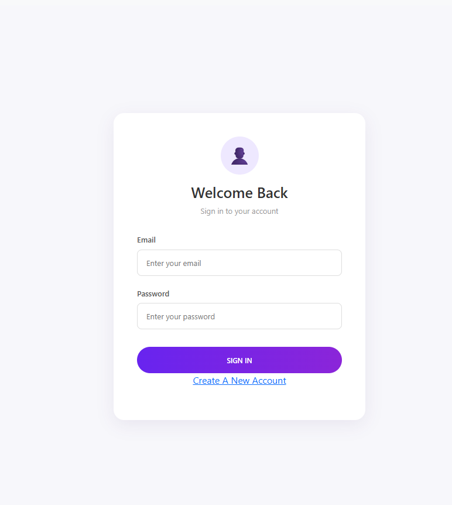
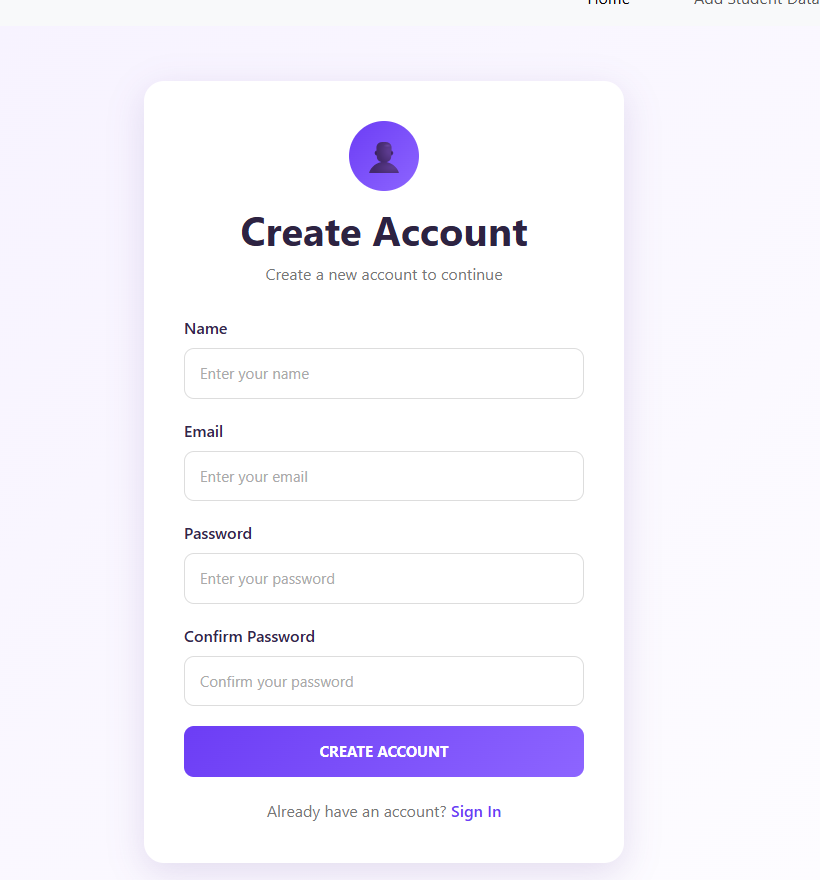

# 📚 Student Management System - Project Documentation

## 📌 Introduction

The **Student Management System** is a modern and responsive web application developed using React.js.

The main purpose of this project is to provide an easy-to-use interface for managing student examination records.

The application allows teachers or users to:

- Add student examination records
- View student records
- Search students
- Filter students
- Edit student records
- Delete student records
- View student statistics
- Register new users
- Sign in users
- View user profile
- Navigate between application pages

The project uses **JSON Server** as a local REST API and **Redux Toolkit** for state management.

---

# 🎯 Project Objectives

The main objectives of this project are:

1. Build a responsive React application.
2. Practice React functional components.
3. Understand React Hooks.
4. Implement CRUD operations.
5. Use Axios for API communication.
6. Use JSON Server as a local backend.
7. Implement Redux Toolkit for state management.
8. Implement React Router DOM for navigation.
9. Create reusable UI components.
10. Implement search and filtering functionality.
11. Implement form validation.
12. Create a modern and responsive dashboard.

---

# 🛠️ Technologies Used

## Frontend Technologies

- React.js
- JavaScript
- HTML5
- CSS3
- Bootstrap 5

## State Management

- Redux Toolkit
- React Redux

## Routing

- React Router DOM

## API Communication

- Axios

## Backend / Local API

- JSON Server

## Build Tool

- Vite

---

# 🏗️ Application Architecture

The project follows a component-based React architecture.

```text
User
 │
 ▼
React Application
 │
 ├── Components
 │
 ├── Pages
 │
 ├── React Router
 │
 ├── Redux Toolkit
 │
 └── Axios
       │
       ▼
   JSON Server
       │
       ▼
    db.json
```

---

# 📁 Main Project Structure

```text
Student-Management-System/
│
├── public/
│
├── src/
│   │
│   ├── app/
│   │   └── store.js
│   │
│   ├── Component/
│   │   └── Headers.jsx
│   │
│   ├── Fetures/
│   │   └── exam/
│   │       └── examSlice.js
│   │
│   ├── Pages/
│   │   ├── Studentdata.jsx
│   │   ├── Studentdata.css
│   │   ├── AddStudentData.jsx
│   │   ├── AddStudentData.css
│   │   ├── UserProfile.jsx
│   │   ├── UserProfile.css
│   │   ├── Signin.jsx
│   │   ├── Signin.css
│   │   ├── Register.jsx
│   │   └── Register.css
│   │
│   ├── App.jsx
│   ├── main.jsx
│   └── index.css
│
├── db.json
├── package.json
├── vite.config.js
└── README.md
```

---


# 🎨 Styling

The project uses:

- Bootstrap 5
- Custom CSS

Each major page has its own CSS file.

Examples:

```text
Studentdata.css
AddStudentData.css
UserProfile.css
Signin.css
Register.css
```

---

# 📱 Responsive Design

The application is designed to work on different screen sizes.

Supported devices:

- Desktop
- Laptop
- Tablet
- Mobile

---

# 🎨 Dashboard Design

The dashboard uses a modern interface with:

- Purple gradient design
- White cards
- Rounded corners
- Statistics cards
- Search field
- Filter tabs
- Student table
- Action buttons
- Responsive layout

---

# 🔄 Complete Student Flow

The complete student management flow is:

```text
Add Student
     │
     ▼
Student Form
     │
     ▼
Form Validation
     │
     ▼
Axios POST
     │
     ▼
JSON Server
     │
     ▼
db.json
     │
     ▼
Student List
     │
     ├──────────────┐
     ▼              ▼
   Edit           Delete
     │              │
     ▼              ▼
Axios PUT       Axios DELETE
     │              │
     └──────┬───────┘
            ▼
      Updated List
```

---

# 🔐 Complete User Flow

```text
New User
   │
   ▼
Register
   │
   ▼
Validation
   │
   ▼
JSON Server
   │
   ▼
Account Created
   │
   ▼
Sign In
   │
   ▼
Dashboard
```

---

# 🧪 API Testing

JSON Server can be tested directly from the browser.

Start JSON Server:

```bash
npm run server
```

Then open:

```text
http://localhost:5000/student
```

For users:

```text
http://localhost:5000/users
```

---

# 🎯 Learning Outcomes

After completing this project, the developer can understand:

- React.js fundamentals
- Functional components
- React Hooks
- `useState`
- `useEffect`
- React Router
- Redux Toolkit
- Redux Store
- Redux Slice
- Async Thunks
- Axios
- REST APIs
- JSON Server
- CRUD operations
- Form handling
- Form validation
- Search functionality
- Filtering
- Bootstrap
- Responsive CSS
- Component-based architecture

---

# 📈 Future Improvements

The project can be extended with additional features.

## Authentication

- JWT Authentication
- Secure Login
- Logout
- Protected Routes
- Role-Based Access

## Student Management

- Student Details Page
- Student ID
- Student Email
- Student Phone
- Student City
- Student Photo
- Class and Grade
- Attendance Management

## Examination

- Multiple Exam Records
- Exam Result Page
- Grade Calculation
- Percentage Calculation
- Student Performance
- Subject-wise Performance

## Reports

- Generate PDF Reports
- Export Excel Data
- Print Student Results
- Download Student Reports

## Dashboard

- Charts
- Graphs
- Performance Analytics
- Attendance Charts
- Subject Statistics

## Backend

The local JSON Server can eventually be replaced with:

- Node.js
- Express.js
- MongoDB
- MySQL
- PostgreSQL
- Firebase

---

# 🔒 Security

The current project is intended mainly for learning and development.

The application uses JSON Server as a local backend.

Passwords should not be stored as plain text in a production application.

A production application should use:

- Password hashing
- JWT authentication
- Secure sessions
- HTTPS
- Environment variables
- Secure database
- Protected API routes
- Server-side validation

---

# 📸 Screenshots

Screenshots can be added to the project using a `screenshots` folder.

Example:

```text
screenshots/
│
├── studentdata.png
├── add-student.png
├── student-list.png
├── user-profile.png
├── signin.png
└── register.png
```

Then add them to this documentation:

markdown
## Dashboard



## Add Student



## Student List


## User Profile



## Sign In



## Register




---

# 🧠 Important Concepts Used

## React

React is used to create the user interface and reusable components.

## Redux Toolkit

Redux Toolkit manages application state.

## React Router DOM

React Router handles navigation between pages.

## Axios

Axios handles HTTP requests.

## JSON Server

JSON Server provides a simple local REST API.

## Bootstrap

Bootstrap provides responsive UI components and layouts.

## CSS

Custom CSS is used to create the application's visual design.

## Vite

Vite provides the development environment and production build system.

---

# 🔄 Overall Data Flow

```text
                 React UI
                    │
                    ▼
              User Interaction
                    │
                    ▼
              React Component
                    │
            ┌───────┴────────┐
            │                │
            ▼                ▼
       Redux Toolkit       Axios
            │                │
            │                ▼
            │           JSON Server
            │                │
            │                ▼
            │             db.json
            │
            ▼
        Redux Store
            │
            ▼
       Updated UI
```

---

# 📦 Main Dependencies

The main packages used in the project are:

```text
react
react-dom
react-router-dom
@reduxjs/toolkit
react-redux
axios
bootstrap
json-server
vite
```

Install dependencies using:

```bash
npm install
```

---

# 🧑‍💻 Development Guidelines

When working on the project:

1. Keep components reusable.
2. Keep API URLs consistent.
3. Keep Redux logic inside Redux slices.
4. Keep page-specific styling inside CSS files.
5. Validate forms before sending API requests.
6. Handle API errors using `try/catch`.
7. Keep route definitions inside `App.jsx`.
8. Keep `BrowserRouter` inside `main.jsx`.
9. Keep the database inside `db.json`.
10. Start both React and JSON Server during development.

---

# 🗂️ Recommended Folder Organization

```text
src/
│
├── app/
│   └── store.js
│
├── Component/
│   └── Headers.jsx
│
├── Fetures/
│   └── exam/
│       └── examSlice.js
│
├── Pages/
│   ├── Studentdata.jsx
│   ├── Studentdata.css
│   ├── AddStudentData.jsx
│   ├── AddStudentData.css
│   ├── UserProfile.jsx
│   ├── UserProfile.css
│   ├── Signin.jsx
│   ├── Signin.css
│   ├── Register.jsx
│   └── Register.css
│
├── App.jsx
├── main.jsx
└── index.css
```

---

# 🚀 Quick Start

For a quick start, run these commands in two terminals.

## Terminal 1

```bash
npm install
npm run dev
```

## Terminal 2

```bash
npm run server
```

Then open:

```text
http://localhost:5173
```

---

# 🏁 Project Completion

The Student Management System demonstrates a complete frontend application workflow using React.

The project combines:

```text
React.js
   +
Redux Toolkit
   +
React Router DOM
   +
Axios
   +
JSON Server
   +
Bootstrap
   +
CSS
   +
Vite
```

Together, these technologies provide a practical example of building a modern React-based CRUD application.

---

# 👨‍💻 Author

## Tushar Patel

**Full Stack Developer**

### Technologies Used

- React.js
- JavaScript
- Redux Toolkit
- React Router DOM
- Axios
- Bootstrap
- CSS
- JSON Server
- Vite

---

# ⭐ Support

If you find this project useful, please consider giving the GitHub repository a ⭐.

Your support is appreciated! ❤️

---

# 📄 License

This project is created for **educational and portfolio purposes**.

---

# 🙏 Thank You

Thank you for checking out the **Student Management System**.

This project was created to practice modern frontend development using React, Redux Toolkit, React Router, Axios, JSON Server, Bootstrap, and Vite.

---

# 🚀 Happy Coding!

**Made with ❤️ using React.js**
